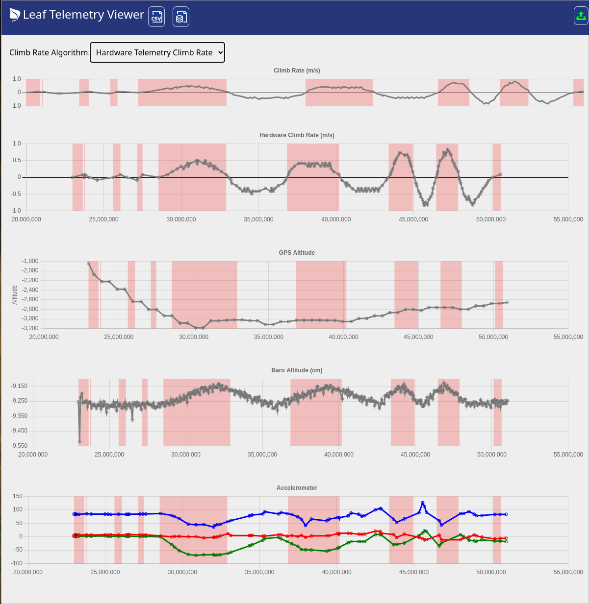
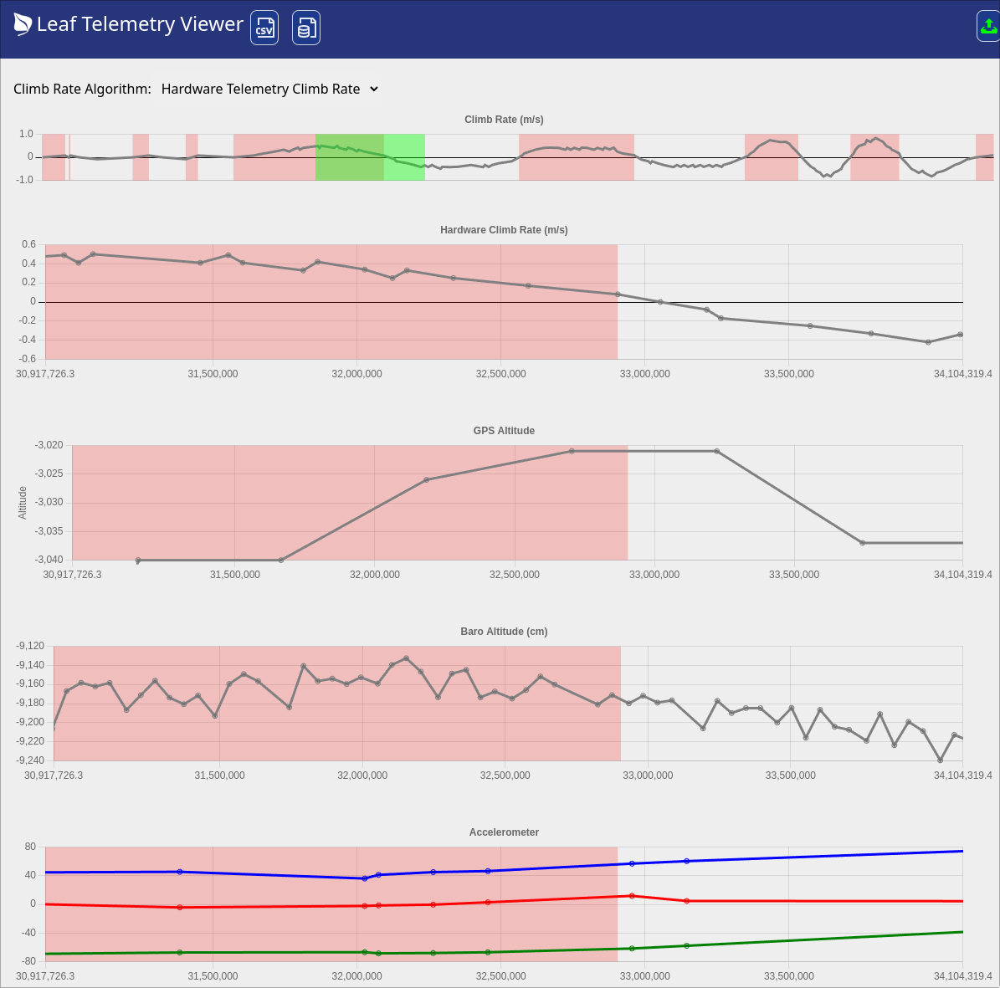
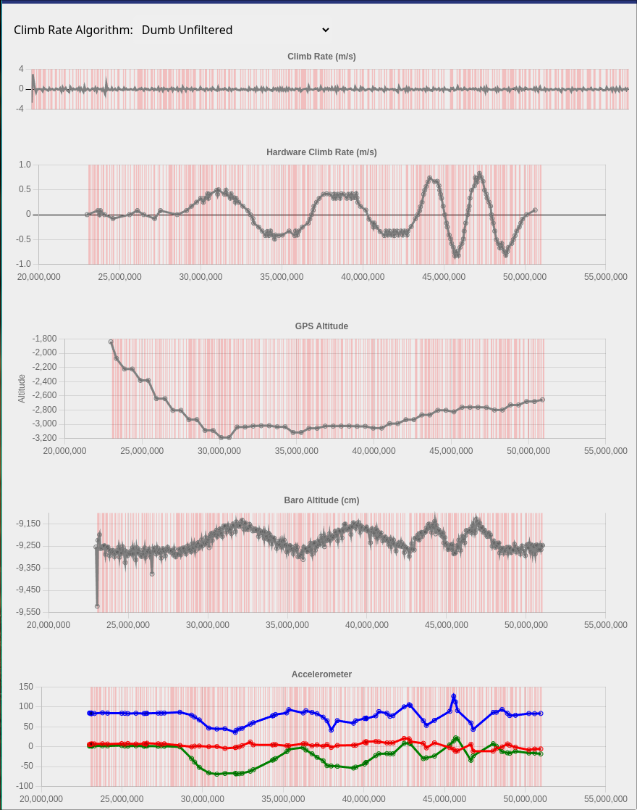

# Leaf Telemetry Viewer

This is a Telemetry Viewer for the [Leaf Vario Project](https://github.com/DangerMonkeys/leaf).  It takes the binary data, will show graphs of some of the data, and enable exporting it into more verbose JSON or CSV file formats.

This project provides a simple way of adding in additional computed fields for the purpose of testing new algorithms using existing collected Telemetry data.

This is a work in progress, and the telemetry format has not yet been merged into the main branch.


## Using

Either fork this, and follow the instructions below to add additional computed fields, or use the hosted [Leaf Telemetry Viewer](https://scottyob.github.io/leaf-telemetry-viewer/)

To get you started, you can use the [Demo Telemetry File](assets/demo_telemetry.dat) to get you started.

Once you load in a telemetry file (button at the top), you'll be shown something like this:


You can click and drag on any of the graphs to Zoom in


The red areas shown are a positive climb rate.  Some algorithms are better than *others*



In the examples above, you can see that the Leaf v0.0.6 algorithm with default sensitivity is not very good at detecting the edges of a climb.  It will be positive just after the start of a climb, and nevative just after the start of a descent.

Exporting to a csv will yield something like this:
```json
[
  {
    "micros": 22979892,
    "gpsPosition": {
      "altitude": -1839,
      "latitude": 1.83e-322,
      "longitude": null
    },
    "temperatureHumidity": {
      "temperature": 19,
      "humidity": 52
    },
    "baroPressureRaw": {
      "d1": 8653586
    },
    "baroTemp": {
      "d2_t": 8464810
    },
    "baroSensorCalibrations": {
      "c_sens": 48122,
      "c_off": 48548,
      "c_tcs": 29334,
      "c_tco": 26634,
      "c_tref": 32597,
      "c_tempsens": 27611
    },
    "climbRate": 0,
    "imuOrientation": {
      "q1": 0,
      "q2": 0,
      "q3": 0,
      "accuracy": 0
    },
    "imuAcceleration": {
      "x": 568,
      "y": 172,
      "z": 8448,
      "accuracy": 0
    }
  },
  {
    "micros": 22979892,
    "baroAltitude": -9253.899487211407
  },
  {
    "micros": 22979892,
    "baroPressure": 102441.62266807741
  },
  {
    "micros": 23046508,
    "imuOrientation": {
      "q1": 0,
      "q2": 0,
      "q3": 0,
      "accuracy": 0
    },
    "imuAcceleration": {
      "x": 670,
      "y": 200,
      "z": 8448,
      "accuracy": -84
    }
  }
]
```

## Adding in new computed fields

1. Modify `src/additionalTelemetry.ts` to add in your new computed fields.
2. (optionally) add in a file to `src/dataSources/` to add the logic for computing your field.
3. Modify the `GetTelemetry` function in `src/additionalTelemetry.ts` to add in your new computed field.

If your new field is a new **Climb Rate Algorithm**, then you can change `src/components/liftModelSelector.tsx` to add in a new option for the user to select it.


## 🧞 Commands to Get you Started Developing

All commands are run from the root of the project, from a terminal:

| Command                   | Action                                           |
| :------------------------ | :----------------------------------------------- |
| `npm install`             | Installs dependencies                            |
| `npm run dev`             | Starts local dev server at `localhost:4321`      |
| `npm run build`           | Build your production site to `./dist/`          |
| `npm run preview`         | Preview your build locally, before deploying     |
| `npm run astro ...`       | Run CLI commands like `astro add`, `astro check` |
| `npm run astro -- --help` | Get help using the Astro CLI                     |
